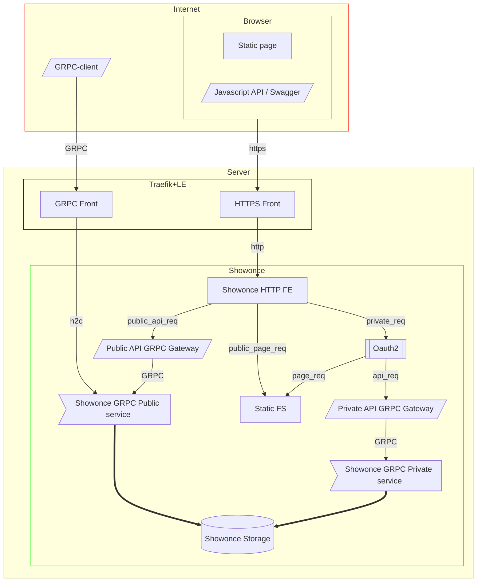

# mermaid-neutral

Showonce request flow:

```mermaid
%%{init: {"theme": "neutral" }%%
flowchart TD
  subgraph web[Internet]
    subgraph br[Browser]
      page[Static page]
      js[/Javascript API / Swagger/]
    end
    grpcc[/GRPC-client/]
  end
  subgraph srv[Server]
    subgraph tr[Traefik+LE]
      br-- https -->httpf[HTTPS Front]
      grpcc-- GRPC -->grpcf[GRPC Front]
    end
    subgraph so[Showonce]
      httpf-- http -->http[Showonce HTTP FE]
      grpcf-- h2c -->pub>Showonce GRPC Public service]
      http-- public_page_req -->static[Static FS]
      http-- public_api_req -->gw_pub[/Public API GRPC Gateway/]
      http-- private_req -->oauth[[Oauth2]]
      oauth-- page_req -->static
      oauth-- api_req -->gw_priv[/Private API GRPC Gateway/]
      gw_pub-- GRPC -->pub
      gw_priv-- GRPC -->priv>Showonce GRPC Private service]
      pub ==> st[(Showonce Storage)]
      priv ==> st
    end
  end
  classDef out stroke:#f00
  classDef our stroke:#0f0
  classDef ext stroke:#00f
  class web out;
  class tr ext;
  class so our;
```
